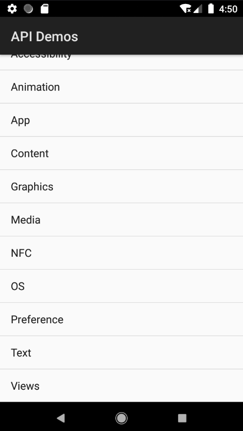

# Tech Stack | 技术栈
- **Language / 语言**: Java  
- **Framework / 测试框架**: TestNG  
- **Tool / 工具库**: Appium Java Client 7.x  
- **Platform / 平台**: Android  

# ApiDemos-debug: Testing Demo 
## Overview | 概述  
ApiDemos-debug is a demo app mainly used for automation testing of gestures, views and other basic related content. 
ApiDemos debug是一个demo app，项目主要包括了对gestures, views等内容的自动化测试。

## Features Covered | 覆盖
- Long press elements to trigger actions (pop-up...) 长按元素触发弹窗
- Scroll through long lists and find elements 滑动长列表并查找元素
- Swipe between images and validate focus 图片滑动并验证焦点切换
- Rotate device screen orientation (landscape/portrait) 切换设备屏幕方向（横屏/竖屏）
- Drag and drop elements to specific positions 拖拽元素到指定位置
- Work with clipboard 剪贴板正常运作
- Simulate Android hardware keys (BACK, HOME, ENTER) 模拟Android按键（返回、主页、回车）

## Some Images | 部分展示

