# Tech Stack | 技术栈
- **Language / 语言**: Java  
- **Framework / 测试框架**: TestNG  
- **Tool / 工具库**: Appium Java Client 7.x  
- **Platform / 平台**: Android   

# ApiDemos-debug.apk: Testing Demo 
## Overview | 概述  
ApiDemos-debug is a demo app mainly used for automation testing of gestures, views and other basic related content. 
ApiDemos debug 是一个demo app，项目主要包括了对其gestures, views等内容的自动化测试。

## Test Features Covered | 测试覆盖
- Long press elements to trigger actions (pop-up...) 长按元素触发弹窗
- Scroll through long lists and find elements 滑动长列表并查找元素
- Swipe between images and validate focus 图片滑动并验证焦点切换
- Rotate device screen orientation (landscape/portrait) 切换设备屏幕方向（横屏/竖屏）
- Drag and drop elements to specific positions 拖拽元素到指定位置
- Work with clipboard 剪贴板正常运作
- Simulate Android hardware keys (BACK, HOME, ENTER) 模拟Android按键（返回、主页、回车）

## Some Images | 部分展示
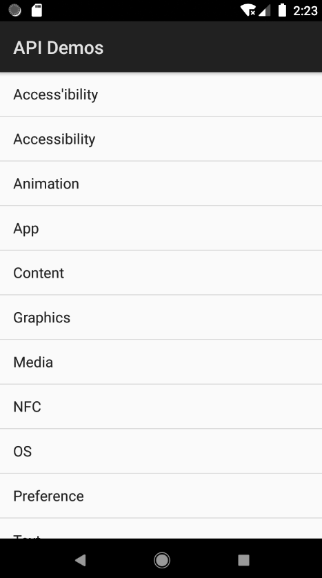
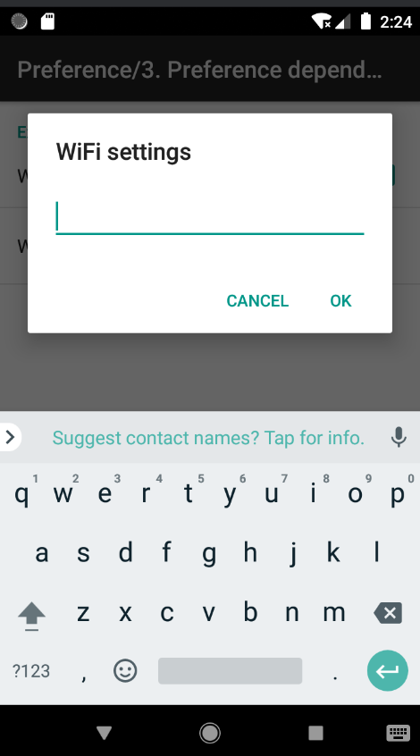
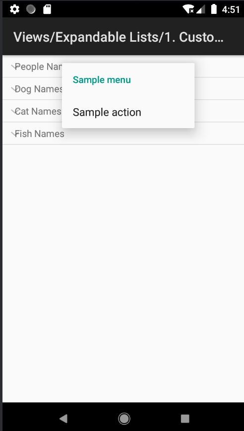
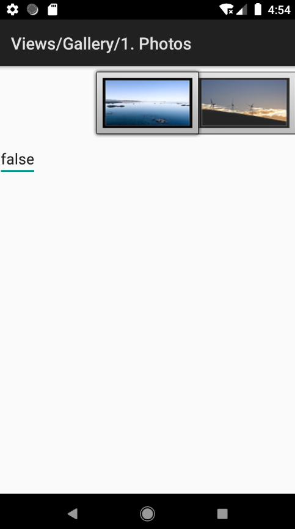
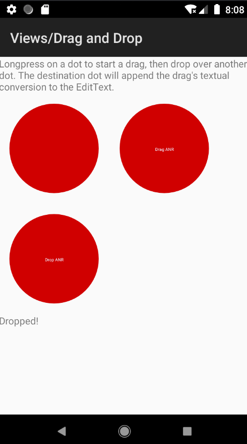 

# General-Store.apk: Cool Sneakers Online Store
## Overview | 概述 
Cool Sneakers Online Store is a mock e-commerce app simulating real shopping flows, including login, browse different trendy sneakers, add to cart, check the cart and sum, interaction with embedded WebViews and so on. 
Cool Sneakers Online Store 是一个模拟真实购物流程的电商应用，涵盖了登录、浏览各种潮流球鞋、添加到购物车、查看购物车及结算，以及与嵌入WebViews交互等功能。

## Test Scenarios Covered | 测试覆盖
- Fill the form details to login, verify Toast messages when null input  填写信息登录，空输入时的 Toast 消息
- Scroll to find expected sneakers, add it to cart  滚动查找想要的球鞋，将其添加到购物车
- Check if sneakers selected are matching with sneakers displayed in the cart  检查所选球鞋是否与购物车中显示的球鞋匹配
- Validate the total Amount displayed matches with sum of product amounts selected  验证显示的总金额与所选商品金额总和是否匹配
- Validate long press gesture (show terms of conditions), navigate to WebView  长按显示条款和条件，以及导航到WebView
- Check if user can do operations on Web view and can go back to Native App  用户可以在 WebView 上操作，并可返回到原生应用

## Some Images | 部分展示

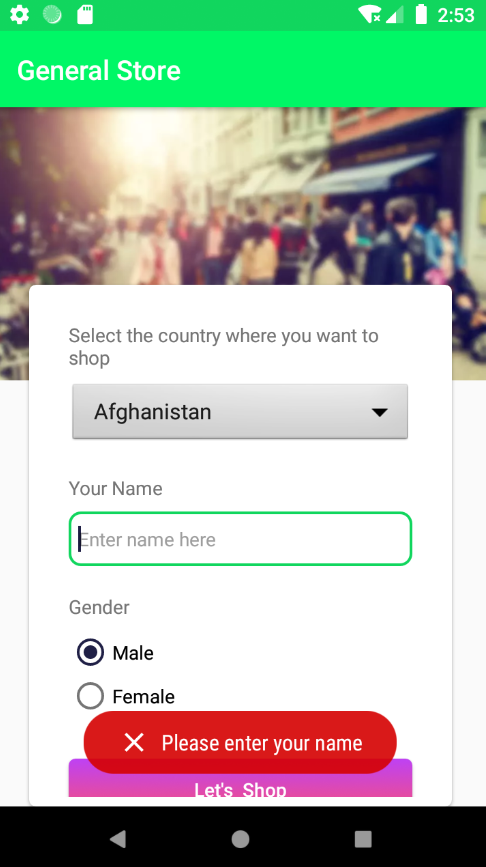
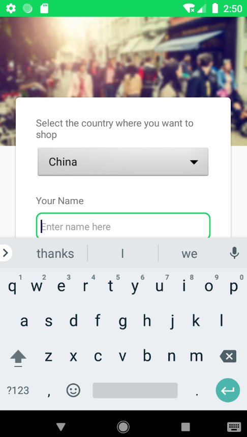
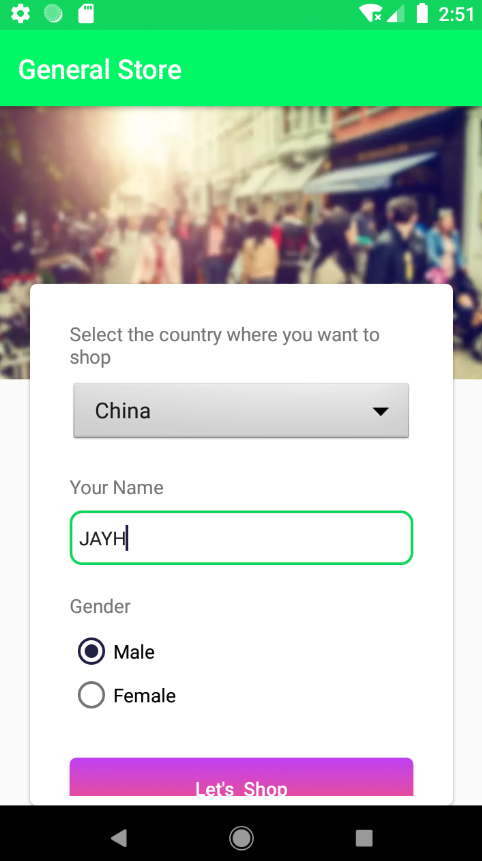
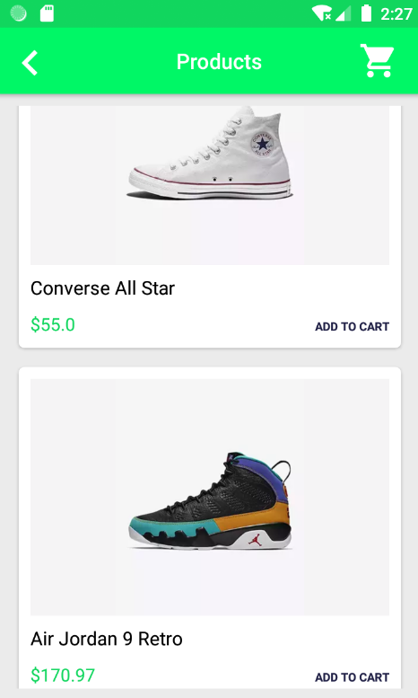
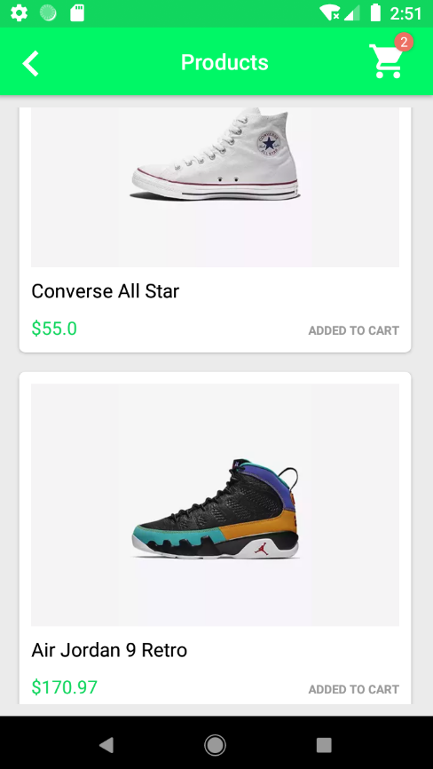
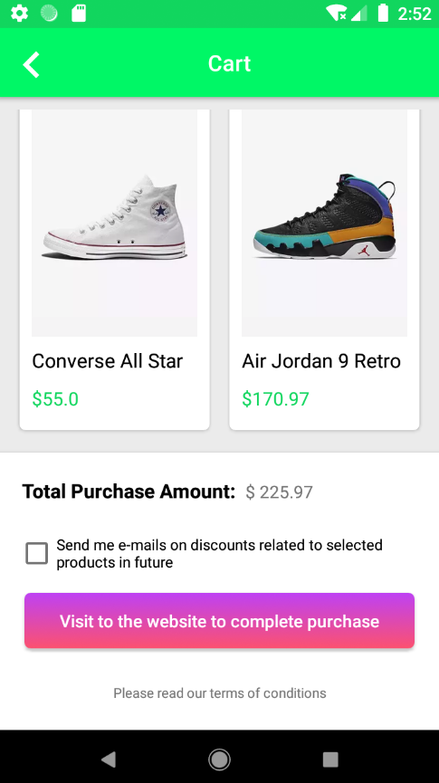
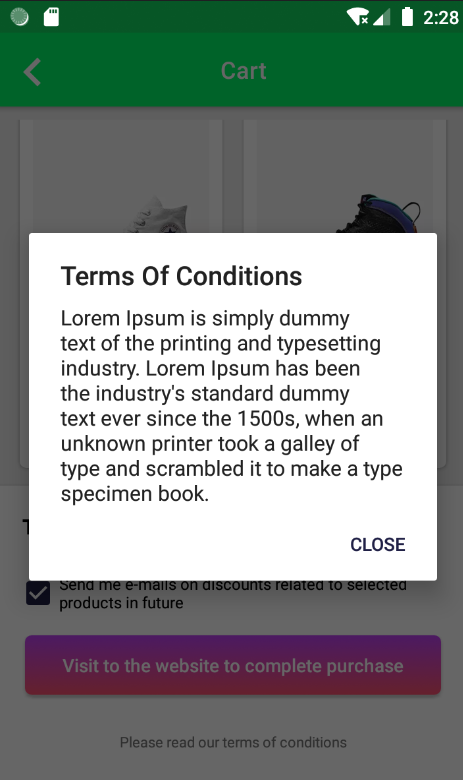 

